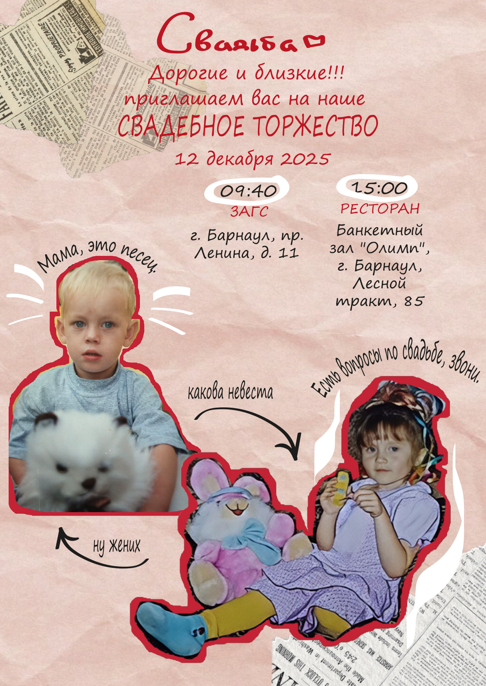
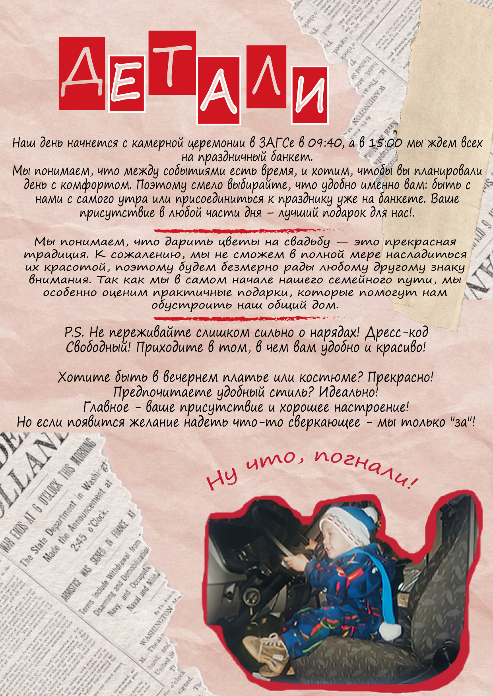
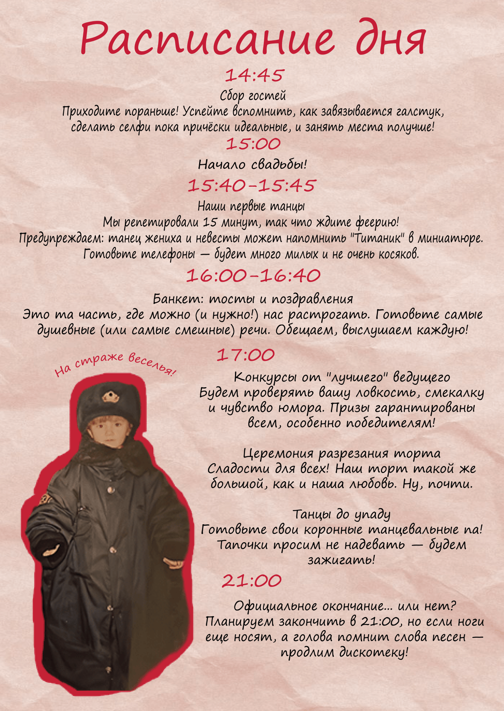
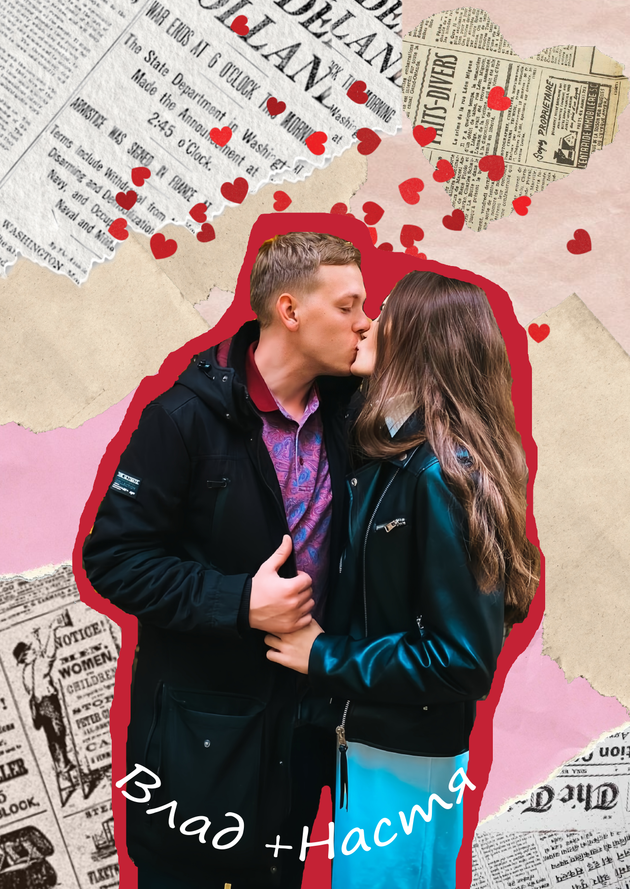

<!DOCTYPE html>
<html lang="ru">
<head>
    <meta charset="UTF-8">
    <meta name="viewport" content="width=device-width, initial-scale=1.0">
    <title>Владислав & Анастасия - Свадьба 12 декабря 2025</title>
    
    <!-- Open Graph метатеги -->
    <meta property="og:site_name" content="Свадьба Владислава и Анастасии">
    <meta property="og:title" content="💒 Владислав & Анастасия - Свадьба 12 декабря 2025">
    <meta property="og:description" content="🎉 Приглашение на нашу свадьбу! Торжественная регистрация и банкет в Барнауле">
    <meta property="og:image" content="https://iimg.su/i/N98hU2">
    <meta property="og:image:width" content="1200">
    <meta property="og:image:height" content="630">
    <meta property="og:image:type" content="image/jpeg">
    <meta property="og:url" content="https://gibelvlad.github.io/22/">
    <meta property="og:type" content="website">
    <meta property="og:locale" content="ru_RU">
    
    <!-- Twitter Card -->
    <meta name="twitter:card" content="summary_large_image">
    <meta name="twitter:title" content="💒 Владислав & Анастасия - Свадьба 12 декабря 2025">
    <meta name="twitter:description" content="🎉 Приглашение на свадьбу! Торжественная регистрация и банкет в Барнауле">
    <meta name="twitter:image" content="https://iimg.su/i/N98hU2">
    
    
</head>
<body>
    

        

            
Владислав & Анастасия

            
12 декабря 2025

        

        

            
            
            
            
        

        

            
Торжественная регистрация

            
09:40

            
Дворец бракосочетания

            
Пр. Ленина, 11 / ул. Гоголя, 46

        

        
        

            
Банкет в честь свадьбы

            
15:00

            
Банкетный зал "Олимп"

            
Лесной тракт, 85

        

        <a href="https://go.2gis.com/Kupg2" class="map-button" target="_blank">
            Посмотреть банкетный зал на карте
        </a>

        

            <h3 style="text-align: center; color: #c92236; margin-bottom: 20px;">Подтвердите участие</h3>
            
Пожалуйста, ответьте до 1 декабря 2025 года

            
            <form id="rsvpForm" action="https://formspree.io/f/manlrqre" method="POST">
                <input type="hidden" name="_subject" value="Новый ответ на свадьбу Владислава и Анастасии!">
                
                

                    <label for="name">Ваше имя и фамилия</label>
                    <input type="text" id="name" name="name" required placeholder="Например, Иван Иванов">
                

                
                

                    <label for="attendance">Вы сможете прийти?</label>
                    <select id="attendance" name="attendance" required>
                        <option value="">Выберите вариант</option>
                        <option value="yes">С радостью приду!</option>
                        <option value="no">К сожалению, не смогу</option>
                        <option value="maybe">Пока не уверен(а)</option>
                    </select>
                

                
                

                    <label for="companions">Сколько человек будет (включая вас)</label>
                    <select id="companions" name="companions" required>
                        <option value="1">1 человек</option>
                        <option value="2">2 человека</option>
                    </select>
                    <small style="color: #666; display: block; margin-top: 5px;">Если планируете прийти с парой, выберите "2 человека"</small>
                

                

                    <label for="companion_name">Имя и фамилия вашего спутника</label>
                    <input type="text" id="companion_name" name="companion_name" placeholder="Например, Мария Петрова">
                

                

                    <label for="alcohol">Ваши предпочтения в напитках</label>
                    <select id="alcohol" name="alcohol">
                        <option value="none">💧 Я сегодня трезвый(ая), слежу за порядком</option>
                        <option value="wine">🍷 Вино (красное/белое)</option>
                        <option value="champagne">🥂 Шампанское</option>
                        <option value="strong">🥃 Крепкие напитки</option>
                        <option value="all">🎯 Любые напитки</option>
                        <option value="other">💫 Особые пожелания</option>
                    </select>
                

                
                

                    <label for="wishes">Ваши пожелания</label>
                    <textarea id="wishes" name="wishes" rows="3" placeholder="Напишите ваши пожелания..."></textarea>
                

                
                <button type="submit" class="submit-button">ОТПРАВИТЬ ОТВЕТ</button>
            </form>
        

        
        
💖 💕 💗 💓 💞

        
        

            Мы с нетерпением ждём этот день  
            и будем рады разделить его с вами! 
            Ваше присутствие сделает наш праздник 
            ещё более тёплым и незабываемым.
        

        
        

            С любовью, Владислав и Анастасия
        

    

    
</body>
</html>
